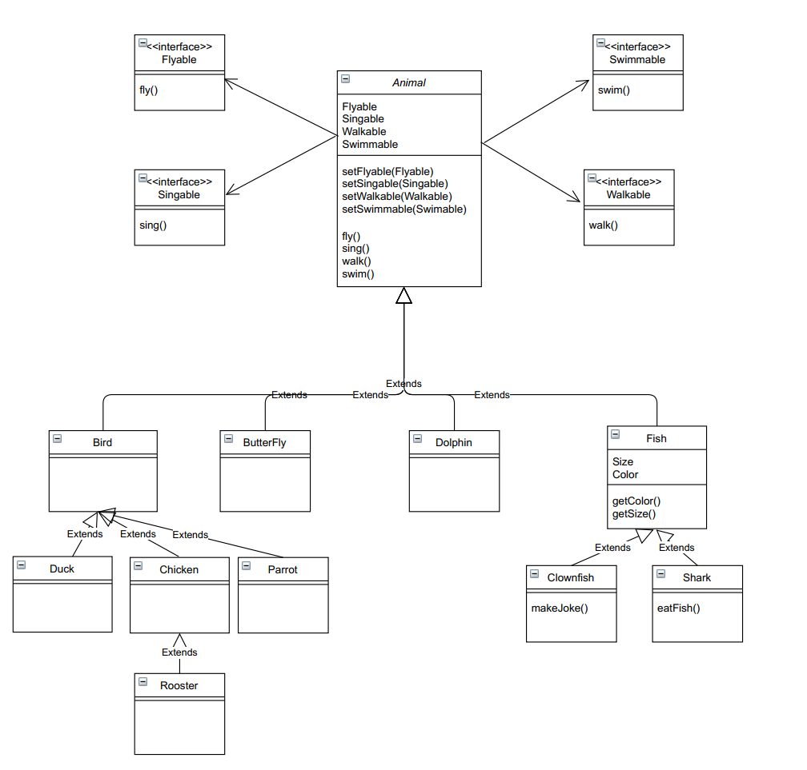

# Assignment
## Assumptions 
**All given classes are inherited from Animal as follows:**
>Rooster **is a** Chicken
>Parrot, Chicken and Duck are Bird, Bird **is an** Animal.

>Clownfish and Shark are Fish, Fish **is an** Animal.
>Dolphin **is an** Animal

>Butterfly **is an** Animal

I considered, walk, fly, swim, and sing are common behavior for each animal.

*Rationale :*
>Some types of butterfly can walk and all the birds can walk, so I considered this a generic behavior of animal.

>Some types of butterfly can fly and some of the birds can fly, so I considered this a generic behavior of animal.

>All types of fish can swim and Duck can swim, so I considered this a generic behavior of animal.

>All types of Bird can sing, and Dog[may be a future class] can sing, so I considered this a generic behavior of animal.

These behavior must be correctly set when an animal is created.
By default, Animal class should set as all above bevavior as disabled.[NoFly, Mute, NoSwim, NoWalk]
Subclasses must set the correct behavior during the initialization.
>For example : 
>>	By default, All the Bird class should be set as Walk, Fly and Sing
	If any subclass having different behavior, must override these during the initialization.(Chicken NoFly)

**Class Diagram**

